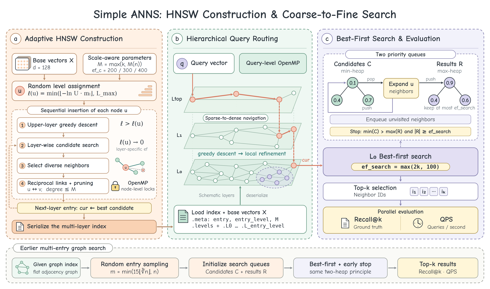

# Simple ANNS

Simple ANNS 通过分层图索引，在高维向量集合中检索近似 Top-k 邻居。仓库提供 C++20 / OpenMP 实现及 SIFT small、SIFT1M 的运行流程，以 Recall@k 和 QPS 评估检索质量与吞吐量。

## 方法概览

[](docs/anns_method_architecture.png)

索引构建采用 HNSW 风格的分层图结构，通过随机层级、逐层候选搜索、多样性邻居筛选和度数裁剪建立索引。节点依次插入，邻接表更新使用 OpenMP 并行和节点锁。实现见 [build_knn.cpp](src/build_knn.cpp)。

查询从入口沿上层贪心路由到基础层 L₀，再使用候选最小堆和结果最大堆进行最佳优先搜索，返回 Top-k 近邻。多个查询通过 OpenMP 并行评测。实现见 [search.cpp](src/search.cpp)。

距离函数为平方欧氏距离。邻居数上限和构建搜索宽度随数据规模设置，查询搜索宽度为 `ef_search = max(2k, 100)`；完整配置见[参数与随机性](docs/reproduction.md#参数与随机性)。

*图中底部为[早期多入口图搜索方案](https://github.com/WalnuTpz/simple-anns-problem/blob/0dbd2ad5b9eee63126093fc1d6c51d34da74d008/ANNS-Problem-new/src/search.cpp)，其索引格式和计时口径与当前实现不同。*

## 快速开始

### 1. 编译

环境要求：Linux / WSL、支持 C++20 的 GCC、OpenMP 和 CMake ≥ 3.16。下载和解压数据需要 `wget`、`tar`；裁剪 ground truth 的脚本使用 Python 3 标准库。

```bash
git clone https://github.com/WalnuTpz/simple-anns-problem.git
cd simple-anns-problem

cmake -S . -B build -DCMAKE_BUILD_TYPE=Release
cmake --build build --parallel
```

### 2. 准备数据

数据来自 [TexMex](http://corpus-texmex.irisa.fr/)，向量维度均为 128。按需下载到 `data/`：

| 数据集 | 基础向量数 | 下载说明 |
| --- | ---: | --- |
| SIFT small | 10,000 | [SIFT small 数据准备](data/README.md#sift-small) |
| SIFT1M | 1,000,000 | [SIFT1M 数据准备](data/README.md#sift1m) |

以下以 SIFT small 为例，命令均在仓库根目录执行。百万规模的完整运行流程见 [SIFT1M 示例](docs/reproduction.md#sift1m-示例)。

### 3. 构建索引

```bash
mkdir -p indexes
OMP_NUM_THREADS=4 ./build/build_knn \
  data/siftsmall/siftsmall_base.fvecs \
  indexes/siftsmall \
  16
```

构建参数为 `K_build=16`，索引写入 `indexes/siftsmall.meta`、`.levels` 和 `.L0`、`.L1` 等层文件。查询时传入同一文件名前缀 `indexes/siftsmall`。

### 4. 查询与评测

```bash
OMP_NUM_THREADS=4 ./build/search \
  data/siftsmall/siftsmall_base.fvecs \
  indexes/siftsmall \
  data/siftsmall/siftsmall_query.fvecs \
  data/siftsmall/siftsmall_groundtruth.ivecs \
  100
```

示例使用 `k=100` 和 4 个 OpenMP 线程，程序输出 `QPS` 与 `Recall@100`。查询参数 `k` 与构建参数 `K_build` 独立。

**ground truth 每行的 ID 数必须与 `k` 一致。** Recall@10 的转换和查询命令见 [SIFT small 扩展示例](docs/reproduction.md#sift-small-示例)。

## 评测口径

| 指标 | 定义 |
| --- | --- |
| Recall@k | 返回集合与 ground-truth Top-k 的交集比例，对所有查询取平均，以百分比输出。 |
| QPS | 查询数除以并行评测循环的总墙钟时间，单位为 queries/s。 |

QPS 计时包含分层路由、L₀ 搜索、Top-k 筛选和 recall 统计，不包含数据加载及索引构建。查询程序输出汇总指标，不保存每条查询的近邻 ID。

性能对比需固定硬件、编译配置、参数和线程数，并记录重复运行的波动。参数定义、输入约束及实验记录模板见[复现说明](docs/reproduction.md)。

## 仓库结构

```text
simple-anns-problem/
├── CMakeLists.txt  # C++20 / OpenMP 构建配置
├── README.md
├── src/            # 索引构建、查询与向量读写
├── scripts/        # Top-k ground truth 裁剪脚本
├── data/           # 数据准备说明与本地数据
└── docs/           # 方法主图、复现说明与课程任务
```

`data/` 仅跟踪 README；数据文件、编译产物 `build/`、图索引 `indexes/` 和本地评测输出 `results/` 均由 `.gitignore` 排除。

## 参考与致谢

本项目源自 *Simple ANNS Problem* 课程实践，基于 [LTTMG/ANNS-Problem-new](https://github.com/LTTMG/ANNS-Problem-new) 的 starter code 开发。原始任务说明见 [Simple ANNS Problem.pptx](docs/Simple%20ANNS%20Problem.pptx)。

分层图搜索参考以下工作，具体算法行为以本仓库实现为准：

Yu. A. Malkov and D. A. Yashunin. [Efficient and robust approximate nearest neighbor search using Hierarchical Navigable Small World graphs](https://arxiv.org/abs/1603.09320).

主图使用 Comic Neue、Lato 和 DejaVu 字体，许可文件见 [docs/font-licenses](docs/font-licenses/)。
